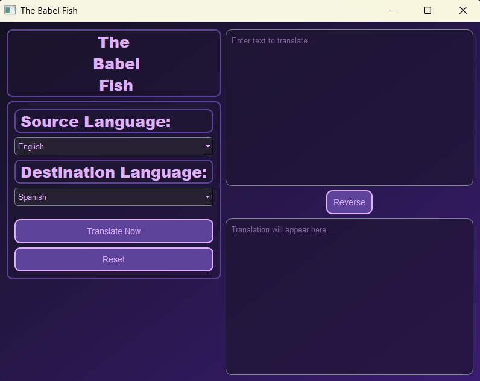

# The Babel Fish

## Project Overview

**The Babel Fish** is a simple yet stylish desktop application for real-time language translation. Built with Python, it provides a clean, responsive, and easy-to-use interface for translating text between a wide range of languages. Its cyberpunk-inspired theme gives it a unique and modern aesthetic.



## Features

* **Real-time Translation:** Instantly translates text as you type.

* **Auto-Detect:** Automatically detects the source language.

* **Language Selection:** Supports over 100 languages via dropdown menus.

* **Reverse Function:** Instantly swaps the source and destination languages, making it easy to translate back and forth.

* **Clean UI:** A modern, cyberpunk-themed user interface designed with a dark color scheme and glowing accents.

## How to Run the Application

### Prerequisites

* Python 3.6 or newer installed on your system.

* `pip` (Python package installer).

### Installation

1.  **Clone this repository** (or download the source code).

2.  **Open your terminal or command prompt** in the project directory.

3.  **Install the required libraries** by running the following commands:

    ```sh
    pip install PyQt5
    pip install googletrans==3.0.0
    ```

    *Note: It is recommended to use `googletrans==3.0.0` to avoid a `RuntimeWarning` that occurs with newer versions of the library.*

### Execution

Run the main application file from your terminal:

```sh
python main.py
```

### Usage

- Type the text you want to translate into the top text box.
- Select your desired source and destination languages from the dropdown menus.
- Click the "Translate Now" button to see the translation appear in the bottom text box.
- Use the "Reverse" button to quickly swap the text and languages between the two boxes.
- Click the "Reset" button to clear both text boxes.

### Credits

PyQt5: For building the user interface.
googletrans: For providing the translation logic.